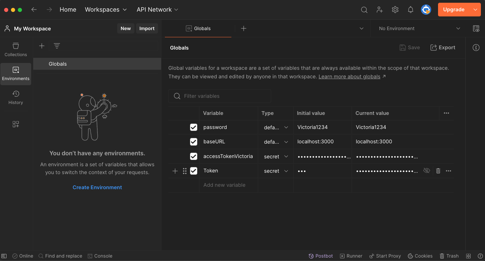
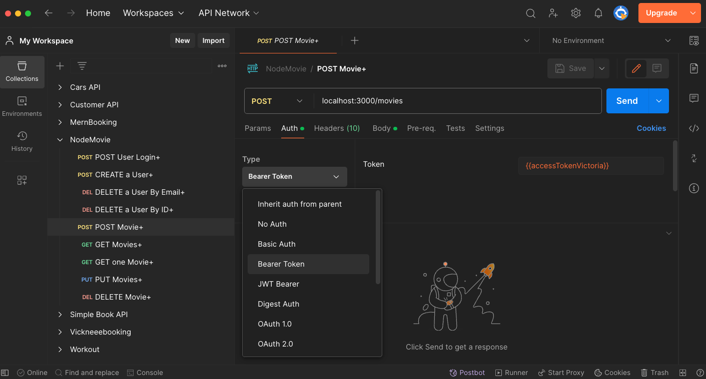
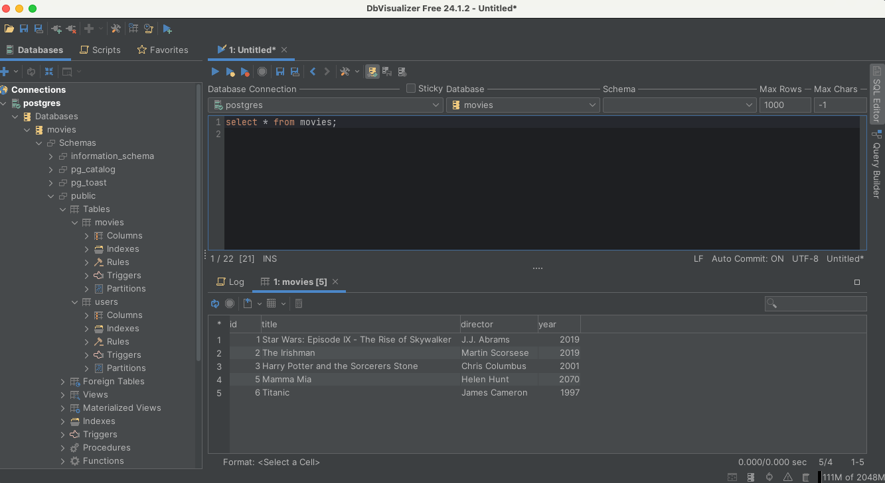
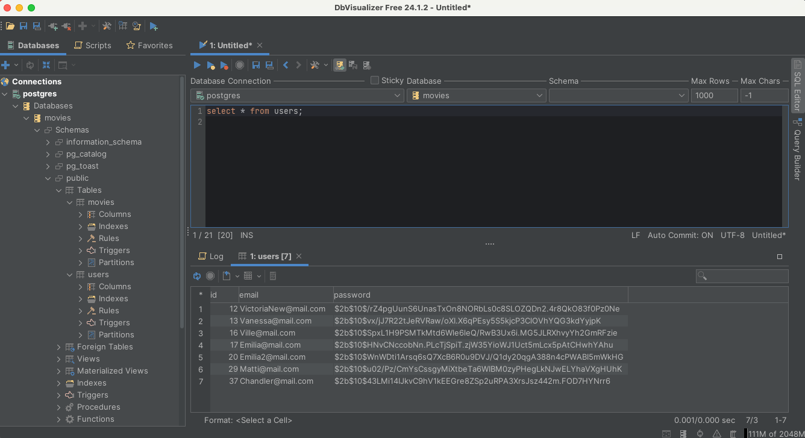
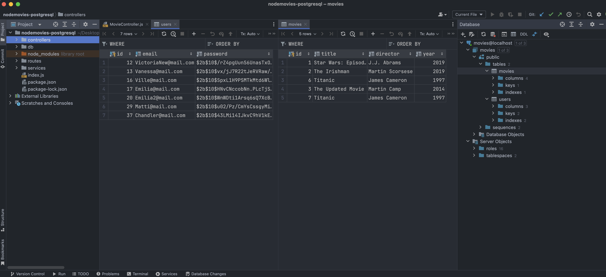
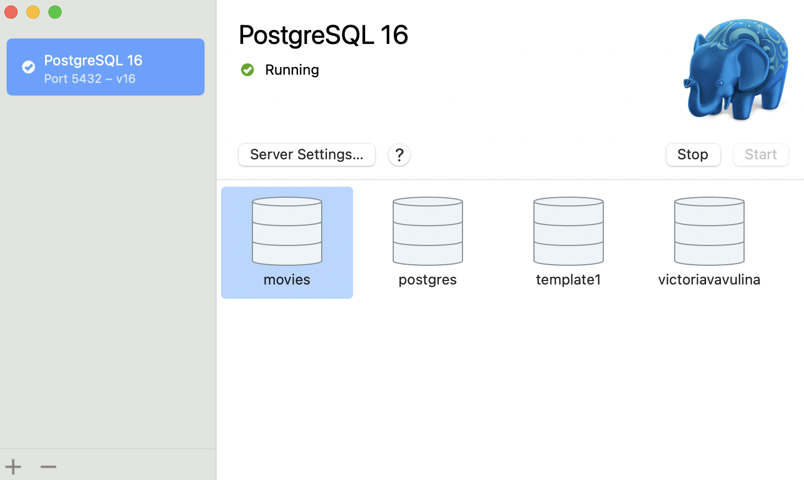

# NodeMovies PostgreSQL Database with JWT & Bcrypt

This is a simple example of a Node.js application that uses a Postgres database. The application is a REST API that allows users to perform CRUD operations on a database of movies. The application uses the `pg` module to connect to the Postgres database and execute SQL queries.

## Tools used

- [Postgres.app](https://postgresapp.com/)
- [Postman](https://www.postman.com/downloads/)
- [DbVisualizer](https://www.dbvis.com/download/)
- [WebStorm](https://www.jetbrains.com/webstorm/)

## Project Structure

```sh
nodemovies-postgresql/
└───controllers/
│   │---MovieController.js
│   └───UserController.js
└───db/
│   └───db.js
└───public/
│   └───image.png   
└───routes/
│   │---MovieRoutes.js
│   │---UserRoutes.js
│   └───AuthRoutes.js
└───services/
│   └───Authenticate.js  
│---.env
│---README.md
│---index.js
│---package.json
│---package-lock.json
└───...
```
## Setup

1. Create a new directory for the project and navigate into it:

```bash
mkdir nodemovies-postgresql // Or name it whatever you want
cd nodemovies-postgresql
```

2. To clone the repository, run the following command in the terminal:

```bash
git clone <required repository>
```

3. To install the required dependencies, run the following command in the terminal:

```bash
npm install
```

4. Create a file called `.env` to store environment variables:

```dotenv
# .env
# You can generate a random secret key using a tool like https://randomkeygen.com/
SECRET_KEY="f|IG/NY=wR|q}DWgV^Gst|]wr5g=E$";
```

5. Create a Postgres database and a table to store movies:

```sql
CREATE DATABASE movies;

CREATE TABLE movies (
    id SERIAL PRIMARY KEY,
    title VARCHAR(255) NOT NULL,
    director VARCHAR(255) NOT NULL,
    year INTEGER NOT NULL
);
    
INSERT INTO movies (title, director, year) VALUES ('The Shawshank Redemption', 'Frank Darabont', 1994);
INSERT INTO movies (title, director, year) VALUES ('The Godfather', 'Francis Ford Coppola', 1972);
INSERT INTO movies (title, director, year) VALUES ('The Dark Knight', 'Christopher Nolan', 2008);

CREATE TABLE users (
    id SERIAL PRIMARY KEY,
    email VARCHAR(255) NOT NULL,
    password VARCHAR(255) NOT NULL
);
    
INSERT INTO users (email, password) VALUES ('example@email.com', 'password');
```

6. Start the server:

```bash
npm start
```

- or install nodemon globally:

```bash
npm install -g nodemon
```

- Then start the server using nodemon:

```bash
npm run dev
```

7. Test the application using a tool like Postman.

8. The application provides the following API endpoints:

---

### User API Routes

#### POST users/auth/register

Create a new user.

**Parameters:**
- `email`: The email of the user.
- `password`: The password of the user.

**Responses:**
- `200`: User created successfully.
- `500`: Server error.
-
---

#### POST /users/auth/login

Login a user.

**Authentication:**
- This route requires authentication.

**Parameters:**
- `email`: The email of the user.
- `password`: The password of the user.

**Responses:**
- `200`: User logged in successfully.
- `401`: Unauthorized.
- `500`: Server error.

--- 

#### DELETE /users/:email

Delete a user by Email.

**Authentication:**
- This route requires authentication.

**Parameters:**
- `email`: The email of the user to delete.

**Responses:**
- `200`: User deleted successfully.
- `500`: Server error.

---

#### DELETE /users/id/:id

Delete a user by ID.

**Authentication:**
- This route requires authentication.

**Parameters:**
- `id`: The ID of the user to delete.

**Responses:**
- `200`: User deleted successfully.
- `500`: Server error.

---

### Movie API Routes

#### POST /movies

Create a new movie.

**Authentication:**
- This route requires authentication.

**Parameters:**
- `title`: The title of the movie.
- `director`: The director of the movie.
- `year`: The year the movie was released.

**Responses:**
- `200`: Movie created successfully.
- `500`: Server error.

---

#### GET /movies

Gets all movies.

**Authentication:**
- This route requires authentication.

**Responses:**
- `200`: Movies retrieved successfully.
- `500`: Server error.

---

#### GET /movies/:id

Get a movie by ID.

**Authentication:**
- This route requires authentication.

**Parameters:**
- `id`: The ID of the movie to get.

**Responses:**
- `200`: Movie retrieved successfully.
- `500`: Server error.

---

#### PUT /movies/:id

Updates a movie by ID.

**Authentication:**
- This route requires authentication.

**Parameters:**
- `id`: The ID of the movie to update.
- `title`: The new title of the movie.
- `director`: The new director of the movie.
- `year`: The new year the movie was released.

**Responses:**
- `200`: Movie updated successfully.
- `500`: Server error.

---

#### DELETE /movies/:id

Delete a movie by ID.

**Authentication:**
- This route requires authentication.

**Parameters:**
- `id`: The ID of the movie to delete.

**Responses:**
- `200`: Movie deleted successfully.
- `500`: Server error.

---

### Postman Authorization Setup

1. First, you need to obtain the token. If you're using the application described in the context, you can do this by sending a POST request to the `/users/auth/login` endpoint with the `email` and `password` in the request body. The response will contain the token.

2. Once you have the token, go to the "Environment" section in Postman (located in the top left corner).

3. Click on the "Globals" button to create a new variable.

4. In the "Globals," add a new variable named `Token` (or any name you prefer). You can add to the Initial value like this `---`.

5. To the Current value, add your token. Save. This will create a global variable that you can use in your requests. You can also create more variables if you want to use different tokens for different environments (e.g., development, testing, production)

6. In the request that requires authentication, go to the "Authorization" tab and select "Bearer Token" from the TYPE dropdown. In the "Token" field, enter `{{Token}}`. This will insert the value of the `Token` variable from the current environment.

7. Now, when you send this request, it will include the Bearer token in the Authorization header, authorizing the request.

---
1. Create a new User

2. Login with the new User to get the token


3. Create a Global Variable



4. Use the Global Variable in the Authorization Header



5. Use the Global Variable in the Authorization Header


---

## Example pictures of the PostgreSQL database

1. DbVisualizer Movies Table



2. DbVisualizer Users Table



3. WebStorm Database View of Movies Table and Users Table



4. Server


